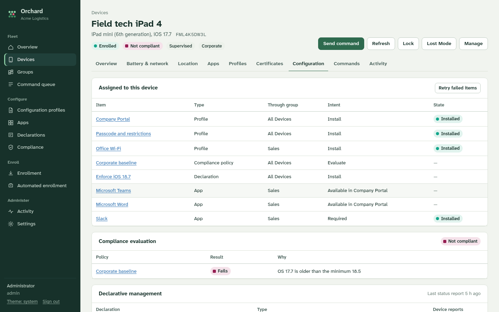
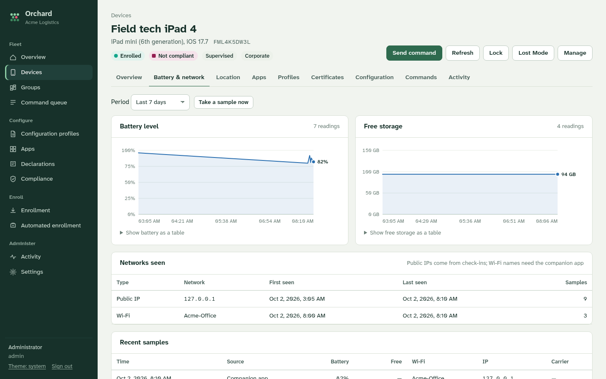
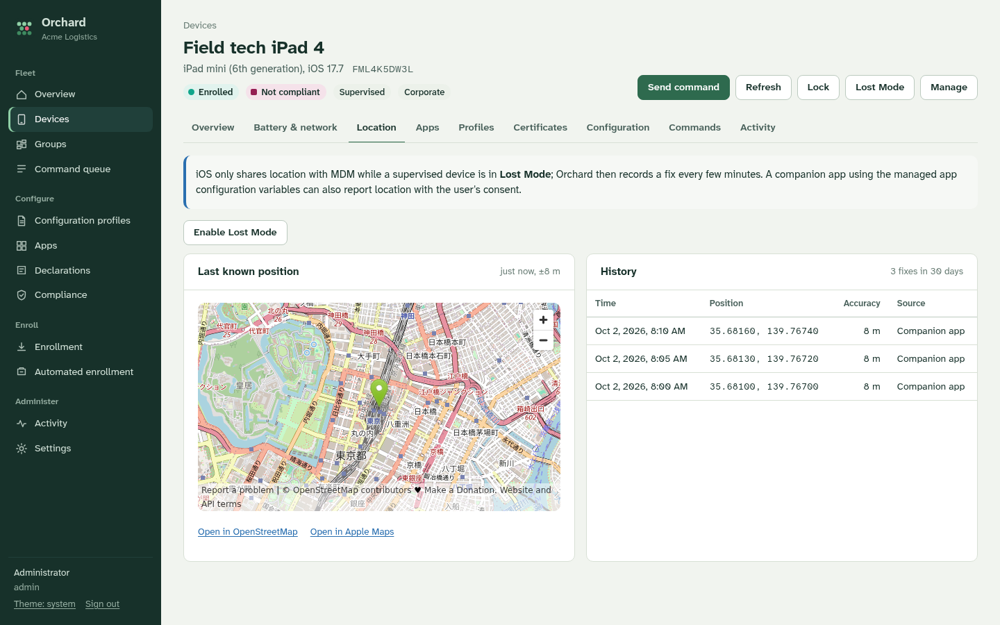
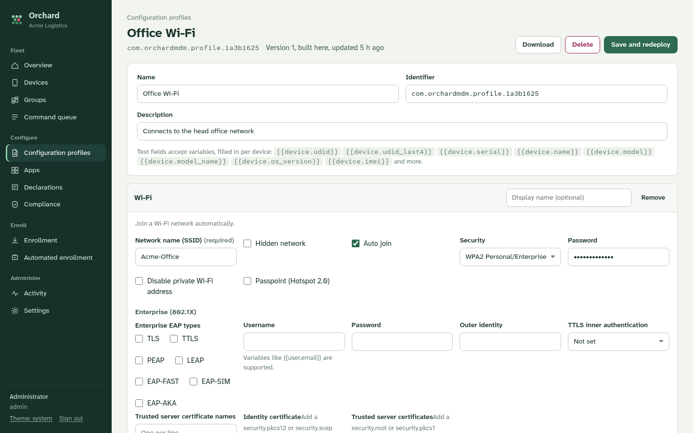

# Orchard MDM

A self-hosted mobile device management server for iPhone and iPad, written in Go. It covers what
teams usually reach for Microsoft Intune or Jamf to do: enroll devices, push Wi-Fi/VPN/email and
restriction profiles, install apps, enforce compliance, run remote actions, and keep an inventory
with battery, network and location history. All of it ships as one binary with a built-in web
console and REST API.

**Orchard MDM deliberately cannot wipe devices.** See [No remote wipe](#no-remote-wipe).


## Features

**Enrollment**
- Enrollment links with QR codes. Each link sets ownership, assigned user, groups, a use limit and an expiry
- **BYOD with User Enrollment:** people add their work account in Settings ("Sign In to Work or School Account").
  Work data stays in a separate volume, and personal apps, data, identifiers and location stay private. Sign-in uses an enrollment code or
  single sign-on (OpenID Connect: Entra ID, Google, Okta…). Service discovery runs via your domain's well-known file or Apple Business Manager.
  Account-driven *device* enrollment for organization-owned devices is also supported ([guide](docs/byod.md))
- Automated Device Enrollment through Apple Business Manager / Apple School Manager: token upload,
  device sync, Setup Assistant profiles (skip screens, supervision, mandatory enrollment, await configuration) and automatic profile assignment
- SCEP-issued device identities with one-time challenges, request signing (`Mdm-Signature`) and identity renewal
- APNs push certificates: CSR generation, signing with your MDM vendor certificate or via
  [mdmcert.download](https://mdmcert.download), upload, renewal checks and expiry warnings

**Configuration**
- Profile builder with ~30 payloads: passcode, restrictions (90+ keys), Wi-Fi (incl. 802.1X), VPN (IKEv2, Cisco IPSec, app VPN),
  encrypted DNS, global proxy, cellular, mail, Exchange, Google, CalDAV/CardDAV, LDAP, web clips, Home Screen layout,
  notifications, lock screen message, Single App Mode, web content filter, managed domains, certificates, SCEP, AirPlay, AirPrint, fonts and custom payloads
- Upload existing `.mobileconfig` files (signed or unsigned)
- Per-device variables such as `{{device.serial}}`, `{{user.email}}` and `{{device.asset_tag}}` in profiles and app configuration
- Declarative Device Management (iOS 16+): declarations, automatic activations, status subscriptions (battery health,
  OS version, passcode, software update state) and per-declaration status
- Profiles are signed with the server's TLS certificate, so iOS shows them as Verified

**Apps**
- App Store apps via search, links or IDs. Apps and Books (VPP) license sync and assignment, with no Apple Account needed
- In-house `.ipa` hosting with generated install manifests
- Required, available (self-service) and uninstall intents. Managed app configuration and attributes. Takeover of user-installed apps

**Groups, assignments and compliance**
- Static groups, dynamic groups (model, iOS version, ownership, tags, installed apps, battery, …) and the built-in All Devices
- Assign profiles, apps, declarations and compliance policies to groups, with exclusions. A reconciler converges every device
  and tracks per-device delivery state, retries and failures
- Compliance policies: minimum/maximum iOS, passcode, encryption, supervision, check-in age, free storage, required/blocked apps,
  roaming, Activation Lock and profile installation. Grace periods, plus optional automatic remote lock

**Devices**
- Inventory: hardware, iOS, storage, battery, carrier, MACs, phone number, supervision, Activation Lock, Find My,
  installed apps, profiles, certificates, restrictions, provisioning profiles, available OS updates
- History: battery and free storage over time, public IPs seen, carrier/roaming, and location fixes (Lost Mode, or a
  [companion app](docs/companion-app.md) for Wi-Fi SSID and GPS)
- 50+ commands: lock with message, restart, shut down, clear passcode, Lost Mode with location tracking and sound,
  iOS updates, rename, wallpaper, Bluetooth/hotspot/roaming settings, time zone, Activation Lock bypass code,
  AirPlay mirroring, eSIM refresh, install/remove profiles, apps and books, and a raw command editor
- Bulk actions, CSV export, a command queue with full request/response inspection, and an activity timeline
- Company Portal for users: device status, compliance reasons, optional apps, support contacts

**Operations**
- Web console with roles (admin, operator, helpdesk, read-only), an audit log, and light/dark themes
- REST API with API keys ([reference](docs/API.md)) and HMAC-signed webhooks
- Single static binary with embedded SQLite (no CGO) and assets. Built-in Let's Encrypt, or run behind a reverse proxy

## Screenshots

| | |
|---|---|
|  |  |
| Device configuration: assignments, compliance and Declarative Management status | Battery, storage and network history |
|  |  |
| Location (Lost Mode or companion app) | Profile builder |
|  |  |
| BYOD device enrolled with User Enrollment | Work account sign-in, as people see it in Settings |

<p align="center"><br>Company Portal, as users see it on their device</p>

## No remote wipe

Orchard was built without device wipe, and enforces that in several places:

- The enrollment profile grants every MDM access right **except "device erase"**, so enrolled devices
  refuse `EraseDevice` even if one were ever sent.
- The command queue refuses `EraseDevice` and `DeleteUser` from every path: the catalog, the raw command editor, the API and automation.
- The passcode payload builder doesn't offer `maxFailedAttempts`, which makes devices erase themselves after
  failed passcodes. It is also stripped (with a warning) from uploaded profiles.
- Compliance actions stop at a remote lock. "Remove management" only removes the MDM profile and the managed
  apps and profiles; the user's data stays on the device.
- BYOD User Enrollments get Apple's fixed rights for personal devices, which never include erase. Removing the work
  account deletes only the separate work volume.

## Requirements

- A domain name and an HTTPS URL devices can reach (`https://mdm.example.com`). iOS requires a publicly trusted TLS certificate.
  Orchard can obtain one from Let's Encrypt, or you can terminate TLS on a reverse proxy.
- An **MDM push certificate** from Apple (free). You need a CSR signed by an MDM vendor: either your own vendor
  certificate from the Apple Developer Program, or the free mdmcert.download service. The console walks you through it.
- Optional: Apple Business Manager for Automated Device Enrollment and Apps and Books.

## Quick start

```sh
# build (Go 1.26+; or use the Docker image below)
go build -o orchard ./cmd/orchard

# run with automatic Let's Encrypt certificates
sudo ./orchard -url https://mdm.example.com -acme-domains mdm.example.com -acme-email it@example.com \
  -listen :443 -http-redirect :80 -data /var/lib/orchard
```

1. Open `https://mdm.example.com`. On first start the server log prints a **setup code**; enter it to create the first administrator
   (or pass `-admin-user` / `-admin-password`).
2. **Settings → Apple Push**: create a certificate request, have it signed, upload it at
   [identity.apple.com/pushcert](https://identity.apple.com/pushcert/), then upload Apple's certificate back to Orchard.
   Note the Apple Account you used: renewals must use the same one.
3. **Enrollment → New enrollment link**, then open the link in Safari on an iPhone or iPad (or scan its QR code) and install the profile.
4. Build profiles, add apps and compliance policies, and assign them to groups. Devices pick changes up within a minute.

### Docker

```sh
docker build -t orchard-mdm .
docker run -d --name orchard -p 443:8443 -p 80:8080 -v orchard-data:/data \
  -e ORCHARD_URL=https://mdm.example.com \
  -e ORCHARD_ACME_DOMAINS=mdm.example.com -e ORCHARD_ACME_EMAIL=it@example.com \
  -e ORCHARD_LISTEN=:8443 -e ORCHARD_HTTP_REDIRECT=:8080 \
  orchard-mdm
```

See [`docker-compose.yml`](docker-compose.yml) for a compose setup.

### Behind a reverse proxy

Devices sign every request (`Mdm-Signature`), so the proxy doesn't need client-certificate authentication. Proxy
everything to Orchard and pass the client address:

```nginx
server {
    listen 443 ssl http2;
    server_name mdm.example.com;
    client_max_body_size 4g;              # in-house .ipa uploads
    location / {
        proxy_pass http://127.0.0.1:8080;
        proxy_set_header Host $host;
        proxy_set_header X-Forwarded-For $remote_addr;
        proxy_set_header X-Forwarded-Proto https;
    }
}
```

Run Orchard with `-url https://mdm.example.com -listen 127.0.0.1:8080 -trust-proxy`.

## Configuration

Every flag can also be set as an environment variable (`ORCHARD_` + upper-case name).

| Flag | Env | Default | Purpose |
|---|---|---|---|
| `-url` | `ORCHARD_URL` | | Public HTTPS base URL devices use |
| `-listen` | `ORCHARD_LISTEN` | `:8443` with TLS, `:8080` without | Listen address |
| `-data` | `ORCHARD_DATA` | `./data` | Database, uploads and ACME cache |
| `-tls-cert`, `-tls-key` | `ORCHARD_TLS_CERT`, `ORCHARD_TLS_KEY` | | TLS certificate files (reloaded when they change) |
| `-acme-domains`, `-acme-email` | `ORCHARD_ACME_DOMAINS`, `ORCHARD_ACME_EMAIL` | | Obtain certificates from Let's Encrypt |
| `-http-redirect` | `ORCHARD_HTTP_REDIRECT` | | Plain HTTP listener that redirects to HTTPS and answers ACME challenges |
| `-trust-proxy` | `ORCHARD_TRUST_PROXY` | `false` | Trust `X-Forwarded-For` / `X-Forwarded-Proto` |
| `-client-cert-header` | `ORCHARD_CLIENT_CERT_HEADER` | | Header carrying a URL-escaped client certificate from a TLS-terminating proxy |
| `-admin-user`, `-admin-password` | `ORCHARD_ADMIN_USER`, `ORCHARD_ADMIN_PASSWORD` | | Create the first administrator non-interactively |
| `-log-level`, `-log-json` | `ORCHARD_LOG_LEVEL`, `ORCHARD_LOG_JSON` | `info` | Logging |
| `-apns-url`, `-dep-url`, `-vpp-url`, `-itunes-url` | | Apple production endpoints | Override Apple endpoints (testing) |

Everything else (organization name, support contacts, enrollment policy, inventory and telemetry intervals, retention,
Lost Mode location polling, profile signing) lives under **Settings** in the console.

## Automation

- **REST API:** create a key under Settings → API keys and send `Authorization: Bearer orch_…`. See [docs/API.md](docs/API.md).
- **Webhooks:** Orchard POSTs JSON events (`device.enrolled`, `device.unenrolled`, `compliance.changed`, `command.failed`,
  `device.location`, `device.telemetry`, `ade.device_added`, `apns.cert_expiring`, …). Verify `X-Orchard-Signature`:
  ```python
  expected = "sha256=" + hmac.new(secret.encode(), body, hashlib.sha256).hexdigest()
  ```

## Architecture

```
cmd/orchard          server entry point
cmd/orchard-sim      simulated iOS devices for demos and load tests
internal/mdm         MDM protocol: enrollment profile, check-in, command queue, results, identity checks
internal/scepsrv     SCEP certificate authority endpoint
internal/apns        APNs HTTP/2 client and push certificate workflows
internal/ddm         Declarative Device Management (declarations, activations, status)
internal/reconcile   dynamic groups and desired-state convergence of profiles, apps and declarations
internal/compliance  compliance evaluation and actions
internal/dep         Automated Device Enrollment (OAuth 1 session, sync, profiles, enrollment endpoint)
internal/vpp         Apps and Books client and license sync
internal/profiles    payload schemas, profile builder and upload parser
internal/api         REST API, sessions, API keys, roles, audit
internal/portal      enrollment pages, work account sign-in (account-driven enrollment, OIDC), Company Portal, companion-agent API, app downloads
internal/store       SQLite persistence (modernc.org/sqlite, no CGO)
web/                 the console (vanilla JS modules, embedded)
```

## Development

```sh
go test ./...                 # unit tests and end-to-end flows with simulated devices
go run ./cmd/orchard -url http://127.0.0.1:8080 -admin-user admin -admin-password 'change-me-now'
go run ./cmd/orchard-sim -enroll http://127.0.0.1:8080/enroll/<token> -n 10
# BYOD: enroll through work account sign-in (turn it on under Enrollment first)
go run ./cmd/orchard-sim -server http://127.0.0.1:8080 -account sam@acme.example -code <enrollment code> -n 2
```

The end-to-end tests enroll simulated devices through real SCEP, sign every request like iOS does, and drive inventory,
commands, Lost Mode location, profile and app assignment, Declarative Management, compliance, ADE (against a fake Apple API),
BYOD account-driven User Enrollment (enrollment code and single sign-on against a fake OpenID Connect provider) and the full REST API.

## Limitations

- Targets iPhone and iPad (device enrollment and BYOD User Enrollment). macOS, tvOS and Shared iPad user channels are not managed.
- BYOD User Enrollment needs Managed Apple Accounts (federated or created in Apple Business Manager).
- The connected Wi-Fi network and continuous location are not available through MDM. Use the
  [companion app approach](docs/companion-app.md), with your users' consent.
- Simulated devices in `orchard-sim` cannot receive real push notifications; they poll instead.

## License

[MIT](LICENSE). The bundled Atkinson Hyperlegible fonts are under the SIL Open Font License
([web/static/fonts/OFL.txt](web/static/fonts/OFL.txt)).
